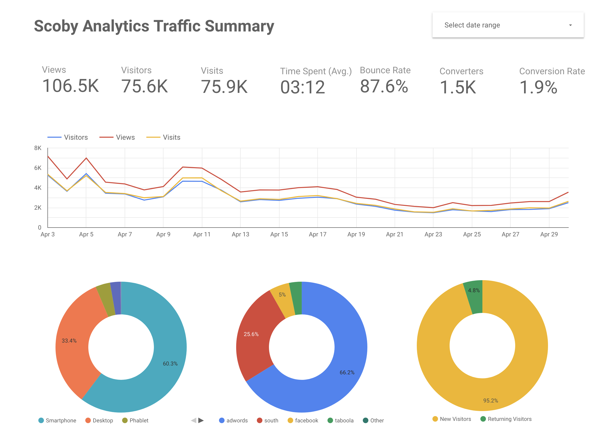
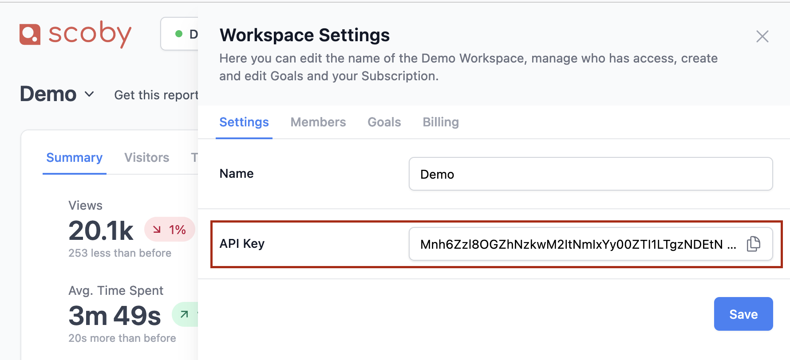
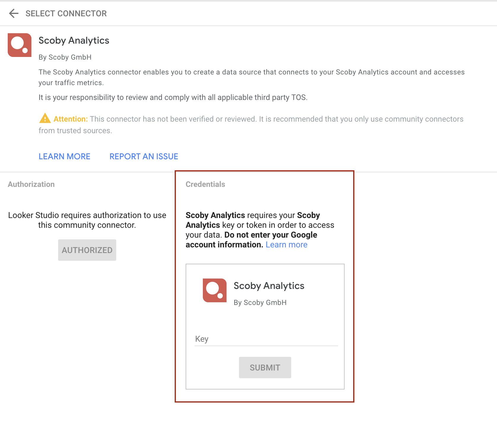

# Scoby Analytics: Looker Studio Connector

Easily connect to Scoby Analytics and access your collected traffic metrics using this [Looker Studio Community Connector](https://developers.google.com/looker-studio/connector). Note that this connector is not an official Google product.

<!-- TOC -->

- [Overview](#overview)
- [Getting Started](#getting-started)
- [Support](#support)
- [Privacy Policy](https://scoby.io/privacy)
- [Terms & Conditions](https://scoby.io/terms)

<!-- /TOC -->

## Overview

[Scoby](https://www.scoby.io) is a privacy-focused analytics tool that provides meaningful metrics without compromising visitor privacy. Anonymous data is collected directly on your web server, with no cookies used and no GDPR, ePrivacy, or Schrems II consent required.

Start your free trial today at [https://app.scoby.io/register](https://app.scoby.io/register)

**Did you know?** Scoby is free for non-profit projects.
[Claim your free account now](mailto:hello@scoby.io?subject=giving%20back)

## Getting Started

To use this Community Connector in Data Studio there is a one-time setup to deploy your own personal instance of the connector using [Apps Script](https://developers.google.com/apps-script).

### Deploy the connector

#### Method 1

Follow the [deployment guide](https://github.com/googledatastudio/community-connectors/blob/master/deploy.md) to deploy the Community Connector.

#### Method 2

**Make a copy** of [this script](https://script.google.com/d/10lSecq1cdg9PA_tpT2qRC0hlZOtA7X9u0-WFOQJw4UD8RitxNZ7p5XMy/edit?usp=sharing) and then **Deploy from manifest...**

## Using the connector in Looker Studio

Once you've set up and deployed the connector, follow the [Use a Community Connector](https://developers.google.com/looker-studio/connector/use) guide to use the connector in Looker Studio.

**Note**: After using the connector in Looker Studio, as long as you do not [revoke access](https://support.google.com/datastudio/answer/9053467), it will remain listed in the [connector list](https://lookerstudio.google.com/u/0/datasources/create) for easy access when [creating a new data source](https://support.google.com/datastudio/answer/6300774).

### Authentication: API Key

While authorizing the App you will be asked to enter the Scoby API Key. You can find your API key in your Workspace Settings.

You will be prompted to enter this **Key** while setting up the connector for the first time.

## Troubleshooting

### This app isn't verified

When authorizing the community connector, if you are presented with an "unverified" warning screen see [This app isn't verified](https://github.com/googledatastudio/community-connectors/blob/master/verification.md) for details on how to proceed.

## Support

For questions or issues, contact our [support team](https://scoby.io/contact).