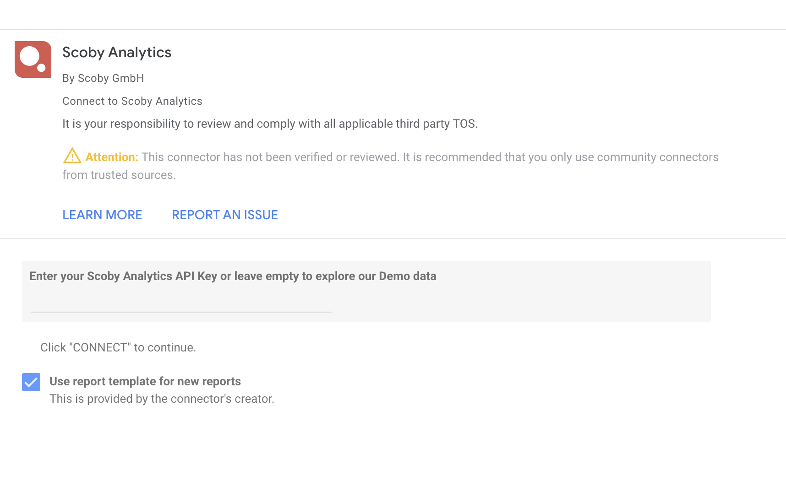

# Scoby Analytics: Looker Studio Connector

Easily connect to Scoby Analytics and access your collected traffic metrics using this [Looker Studio Community Connector](https://developers.google.com/looker-studio/connector). Note that this connector is not an official Google product.

<!-- TOC -->

- [Overview](#overview)
- [Getting Started](#getting-started)
- [Usage](#usage)
- [Support](#support)
- [Privacy Policy](#privacy-policy)
- [Terms & Conditions](#terms-and-conditions)

<!-- /TOC -->

## Overview

[Scoby](https://www.scoby.io) is a privacy-focused analytics tool that provides meaningful metrics without compromising visitor privacy. The data comes directly from your web server, with no cookies used and no GDPR, ePrivacy, or Schrems II consent required.

Start your free trial today at [https://app.scoby.io/register](https://app.scoby.io/register)

**Did you know?** Scoby is free for non-profit projects.
[Claim your free account now](mailto:hello@scoby.io?subject=giving%20back)

## Getting Started

To make requests to the Scoby API, first obtain your API key from the Scoby Analytics Workspace Settings.

### Authentication: API Key

Enter your API Key in the Data Source field to use your Scoby Analytics data in Looker Studio. To explore our free Demo data, leave this field empty.

## Usage

After authenticating your API key, use the connector to access your Scoby Analytics data in Looker Studio seamlessly.

## Support

For questions or issues, contact our support team at hello@scoby.io.

## Privacy Policy

### 1. Data protection at scoby

#### General information

We would like to give you a short and concise overview of what happens to your personal data when you use the scoby website. First of all, for your understanding, personal data are all data with which you "can" be personally identified. You can also find more detailed information in our privacy policy.

#### Data collection on this website

Responsible for data collection on this website? As is so often the case, data processing on this website is carried out by the website operator, in our case scoby GmbH. You can find the exact data under "Note on the responsible party" in this privacy policy.

#### How do we collect your data?

Basically, we collect your data when you provide it to us, i.e. when you communicate it to us. This can be, for example, information that you enter in a contact form. However, there are also other data that are collected automatically or only after your consent when you visit the website by our IT systems. This is mainly technical data (e.g. Internet browser, operating system or time of page view). This data is collected automatically as soon as you enter our website.

#### What is your data used for?

On the one hand, data is collected to ensure error-free provision of the website. On the other hand, other data may be used to analyze your user behavior.

#### What rights do you have regarding your data?

In principle, you always have the right to receive information free of charge about the origin, recipient, and purpose of your stored personal data. You also have the right to request the correction or deletion of this data. If you have given your consent to data processing, you can revoke this consent at any time for the future. You also have the right to request the restriction of the processing of your personal data under certain circumstances. Furthermore, you have the right to lodge a complaint with the competent supervisory authority.

You are welcome to contact us in this regard and also enter into a dialogue with us

### 2. General notes and mandatory information

#### Data protection

For scoby, as the operator of these pages, it is a matter of course and our declared aim to take the protection of your personal data very seriously. We treat your personal data confidentially and in accordance with the statutory data protection regulations and this data protection declaration. However, various personal data are collected when you use our website. Personal data is data with which you can be personally identified. With this data protection declaration, we want to explain to you what data we collect and what we use it for, how this is done and for what purpose. In doing so, we want to give you a secure feeling with regard to the use of data. With today's technological developments, we would like to point out that data transmission on the Internet (e.g. when communicating by e-mail) can also have security gaps. Complete protection of data against access by third parties is difficult, if not impossible.

#### The responsible party

The responsible party for data processing on this website is:

scoby GmbH i.G. 
c/o BoH-Loft Ronsdorfer Strasse 77a 
40233 Duesseldorf 
telephone: +49 (0)211 94 25 26 10 
E-mail: datenschutz@scoby.io

The responsible party is the natural or legal person who alone or jointly with others determines the purposes and means of the processing of personal data (e.g. names, e-mail addresses or similar).

#### Retention period

Apart from special storage periods explicitly listed here, your personal data will only remain with us until the purpose for processing the data no longer applies. We will also delete your data on occasion if you assert a legitimate request for deletion or revoke consent for data processing, unless we have other legally permissible reasons for storing your personal data. These may be, for example, retention periods under tax or commercial law that oblige us to retain the data; in the latter case, the data will be deleted after these reasons have ceased to apply.

#### The legal grounds for data processing on our website

If you have consented to data processing, we process your personal data on the basis of Art. 6(1)(a) DSGVO or Art. 9(2)(a) DSGVO, if special categories of data are processed pursuant to Art. 9(1) DSGVO. In the event of explicit consent to the transfer of personal data to third countries, data processing is also based on Art. 49 (1) a DSGVO.

If your data is required for the onduct of a contract or for the implementation of pre-contractual measures, we process your data on the basis of Art. 6 (1) lit. b DSGVO. Furthermore, if your data is required for the fulfillment of a legal obligation, we process it on the basis of Art. 6 (1) lit. c DSGVO. Furthermore, the data processing may be carried out on the basis of our legitimate interest according to Art. 6 para. 1 lit. f DSGVO. Information on the relevant legal basis in each individual case is provided in the following paragraphs of this data protection declaration.

#### Data protection officer

We have appointed a data protection officer for our company.

Sebastian Müller
scoby GmbH i.G. c/o BoH-Loft
Ronsdorfer Strasse 77a
40233 Duesseldorf

Phone: +49 (0)211 94 25 26 10
E-Mail: datenschutz@scoby.io

#### Revocation of your consent to data processing

Many data processing operations are only possible with your express consent. You can revoke consent you have already given at any time. The legality of the data processing carried out until the revocation remains unaffected by the revocation.

Right to object to data collection in special cases and to direct marketing (Art. 21 DSGVO).

IF DATA PROCESSING IS CARRIED OUT ON THE BASIS OF ART. 6 ABS. 1 LIT. E OR F DSGVO, YOU HAVE THE RIGHT TO OBJECT TO THE PROCESSING OF YOUR PERSONAL DATA AT ANY TIME FOR REASONS ARISING FROM YOUR PARTICULAR SITUATION; THIS ALSO APPLIES TO PROFILING BASED ON THESE PROVISIONS. THE RESPECTIVE LEGAL BASIS ON WHICH PROCESSING IS BASED CAN BE FOUND IN THIS PRIVACY POLICY. IF YOU OBJECT, WE WILL NO LONGER PROCESS YOUR PERSONAL DATA CONCERNED UNLESS WE CAN DEMONSTRATE COMPELLING LEGITIMATE GROUNDS FOR THE PROCESSING WHICH OVERRIDE YOUR INTERESTS, RIGHTS AND FREEDOMS, OR THE PROCESSING IS FOR THE PURPOSE OF ASSERTING, EXERCISING OR DEFENDING LEGAL CLAIMS (OBJECTION UNDER ARTICLE 21(1) DSGVO).

IF YOUR PERSONAL DATA ARE PROCESSED FOR THE PURPOSE OF DIRECT MARKETING, YOU HAVE THE RIGHT TO OBJECT AT ANY TIME TO THE PROCESSING OF PERSONAL DATA CONCERNING YOU FOR THE PURPOSE OF SUCH MARKETING; THIS ALSO APPLIES TO PROFILING INSOFAR AS IT IS RELATED TO SUCH DIRECT MARKETING. IF YOU OBJECT, YOUR PERSONAL DATA WILL SUBSEQUENTLY NO LONGER BE USED FOR THE PURPOSE OF DIRECT MARKETING (OBJECTION PURSUANT TO ARTICLE 21 (2) OF THE GERMAN DATA PROTECTION ACT).

#### Right of appeal to the competent supervisory authority

In the event of violations of the GDPR, data subjects shall have the right to lodge a complaint with a supervisory authority, in particular in the Member State of their habitual residence, their place of work or the place of the alleged violation. The right of appeal is without prejudice to any other administrative or judicial remedy.

#### Right to data portability

You have the right to have data that we process automatically on the basis of your consent or in performance of a contract handed over to you or to a third party in a common, machine-readable format. If you request the direct transfer of the data to another responsible party, this will only be done insofar as it is technically feasible.

#### SSL or TLS encryption

For security reasons and to protect the transmission of confidential content, such as orders or requests that you send to us as the site operator, this site uses SSL or TLS encryption. You can recognize an encrypted connection by the fact that the address line of the browser changes from "http://" to "https://" and by the lock symbol in your browser line.

If SSL or TLS encryption is activated, the data you transmit to us cannot be read by third parties.

#### Information, deletion and correction

Within the framework of the applicable legal provisions, you have the right at any time to free information about your stored personal data, their origin and recipient and the purpose of data processing and, if necessary, a right to correction or deletion of this data. For this purpose, as well as for further questions on the subject of personal data, you can contact us at any time.

#### Right to restriction of processing

You have the right to request the restriction of the processing of your personal data. For this purpose, you can contact us at any time. The right to restriction of processing exists in the following cases:

- If you dispute the accuracy of your personal data stored by us, we usually need time to verify this. For the duration of the review, you have the right to request the restriction of the processing of your personal data.
    
- If the processing of your personal data happened/is happening unlawfully, you can request the restriction of data processing instead of deletion. 
- If we no longer need your personal data, but you need it to exercise, defend or assert legal claims, you have the right to request restriction of the processing of your personal data instead of erasure.  

- If you have lodged an objection pursuant to Art. 21 (1) DSGVO, a balancing of your and our interests must be carried out. As long as it has not yet been determined whose interests prevail, you have the right to request the restriction of the processing of your personal data. 
- If you have restricted the processing of your personal data, this data - apart from its storage - may only be processed with your consent or for the assertion, exercise or defense of legal claims or for the protection of the rights of another natural or legal person or for reasons of an important public interest of the European Union or a Member State.

### 4. Processing of customer and contract data.

If you make use of our services and enter into a contract with us, we collect, process and use your personal customer and contract data for the purpose of establishing, defining the content of and amending our joint contractual relationship.

We collect, process and use personal data about the use of our website (usage data) only to the extent necessary to enable the user to use the service or to bill the user. The legal basis for this is Art. 6 para. 1 lit. b DSGVO.

Your collected customer data will be deleted after completion of the order or termination of the business relationship and expiration of any existing legal retention periods. Legal retention periods must remain unaffected. We ask for your understanding in this regard.

#### Data transfer upon conclusion of contract for services and digital content

We transmit personal data to third parties only if this is necessary in the context of the contract, for example, to the credit institution entrusted with the processing of payments.

Further transmission of data does not take place or only if you have expressly consented to the transmission. Your data will not be passed on to third parties without your express consent, for example for advertising purposes.

The basis for data processing is Art. 6 para. 1 lit. b DSGVO, which permits the processing of data for the fulfillment of a contract or pre-contractual measures.

## Terms and Conditions

Terms and Conditions for the use of Scoby Analytics

#### Last updated: 2023-04-15

These Terms and Conditions ("Terms", "Terms and Conditions") govern your relationship with the Scoby Analytics website (the "Service") operated by scoby GmbH ("us", "we", or "our").

Please read these Terms and Conditions carefully before using the Service. Your access to and use of the Service is conditioned on your acceptance of and compliance with these Terms.

These Terms apply to all visitors, users, and others who access or use the Service. By accessing or using the Service, you agree to be bound by these Terms. If you disagree with any part of the terms, then you may not access the Service.

#### Subscriptions

Some parts of the Service are billed on a subscription basis ("Subscription(s)"). You will be billed in advance on a recurring and periodic basis ("Billing Cycle"). Billing cycles are set on a monthly basis. At the end of each Billing Cycle, your Subscription will automatically renew under the exact same conditions unless you cancel it or scoby GmbH cancels it.

You may cancel your Subscription renewal either through your online account management page or by contacting scoby GmbH customer support team. A valid payment method, including credit card or PayPal, is required to process the payment for your Subscription. You shall provide scoby GmbH with accurate and complete billing information including full name, address, state, zip code, telephone number, and a valid payment method information. By submitting such payment information, you automatically authorize scoby GmbH to charge all Subscription fees incurred through your account to any such payment instruments. Should automatic billing fail to occur for any reason, scoby GmbH will issue an electronic invoice indicating that you must proceed manually, within a certain deadline date, with the full payment corresponding to the billing period as indicated on the invoice.

#### Free Trial

scoby GmbH may, at its sole discretion, offer a Subscription with a free trial for a limited period of time ("Free Trial"). You may be required to enter your billing information in order to sign up for the Free Trial. If you do enter your billing information when signing up for the Free Trial, you will not be charged by scoby GmbH until the Free Trial has expired. On the last day of the Free Trial period, unless you cancelled your Subscription, you will be automatically charged the applicable Subscription fees for the type of Subscription you have selected. At any time and without notice, scoby GmbH reserves the right to (i) modify the terms and conditions of the Free Trial offer, or (ii) cancel such Free Trial offer.

#### Fee Changes

scoby GmbH, in its sole discretion and at any time, may modify the Subscription fees for the Subscriptions. Any Subscription fee change will become effective at the end of the then-current Billing Cycle. scoby GmbH will provide you with a reasonable prior notice of any change in Subscription fees to give you an opportunity to terminate your Subscription before such change becomes effective. Your continued use of the Service after the Subscription fee change comes into effect constitutes your agreement to pay the modified Subscription fee amount.

#### Refunds

Except when required by law, paid Subscription fees are non-refundable.

#### Accounts

When you create an account with us, you must provide us information that is accurate, complete, and current at all times. Failure to do so constitutes a breach of the Terms, which may result in immediate termination of your account on our Service. You are responsible for safeguarding the password that you use to access the Service and for any activities or actions under your password, whether your password is with our Service or a third-party service. You agree not to disclose your password to any third party. You must notify us immediately upon becoming aware of any breach of security or unauthorized use of your account. You may not use as a username the name of another person or entity or that is not lawfully available for use, a name or trademark that is subject to any rights of another person or entity other than you without appropriate authorization, or a name that is otherwise offensive, vulgar, or obscene.

#### Links To Other Web Sites

Our Service may contain links to third-party websites or services that are not owned or controlled by [Your Company Name]. [Your Company Name] has no control over, and assumes no responsibility for, the content, privacy policies, or practices of any third-party websites or services. You further acknowledge and agree that [Your Company Name] shall not be responsible or liable, directly or indirectly, for any damage or loss caused or alleged to be caused by or in connection with the use of or reliance on any such content, goods, or services available on or through any such websites or services. We strongly advise you to read the terms and conditions and privacy policies of any third-party websites or services that you visit.

#### Termination

We may terminate or suspend your account immediately, without prior notice or liability, for any reason whatsoever, including without limitation if you breach the Terms. Upon termination, your right to use the Service will immediately cease. If you wish to terminate your account, you may simply discontinue using the Service.

#### Limitation Of Liability

In no event shall [Your Company Name], nor its directors, employees, partners, agents, suppliers, or affiliates, be liable for any indirect, incidental, special, consequential or punitive damages, including without limitation, loss of profits, data, use, goodwill, or other intangible losses, resulting from (i) your access to or use of or inability to access or use the Service; (ii) any conduct or content of any third party on the Service; (iii) any content obtained from the Service; and (iv) unauthorized access, use, or alteration of your transmissions or content, whether based on warranty, contract, tort (including negligence) or any other legal theory, whether or not we have been informed of the possibility of such damage, and even if a remedy set forth herein is found to have failed of its essential purpose.

#### Disclaimer

Your use of the Service is at your sole risk. The Service is provided on an "AS IS" and "AS AVAILABLE" basis. The Service is provided without warranties of any kind, whether express or implied, including, but not limited to, implied warranties of merchantability, fitness for a particular purpose, non-infringement or course of performance. [Your Company Name], its subsidiaries, affiliates, and its licensors do not warrant that a) the Service will function uninterrupted, secure, or available at any particular time or location; b) any errors or defects will be corrected; c) the Service is free of viruses or other harmful components; or d) the results of using the Service will meet your requirements.

#### Governing Law

These Terms shall be governed and construed in accordance with the laws of Germany, without regard to its conflict of law provisions. Our failure to enforce any right or provision of these Terms will not be considered a waiver of those rights. If any provision of these Terms is held to be invalid or unenforceable by a court, the remaining provisions of these Terms will remain in effect. These Terms constitute the entire agreement between us regarding our Service, and supersede and replace any prior agreements we might have between us regarding the Service.

#### Changes

We reserve the right, at our sole discretion, to modify or replace these Terms at any time. If a revision is material, we will try to provide at least 30 days' notice prior to any new terms taking effect. What constitutes a material
